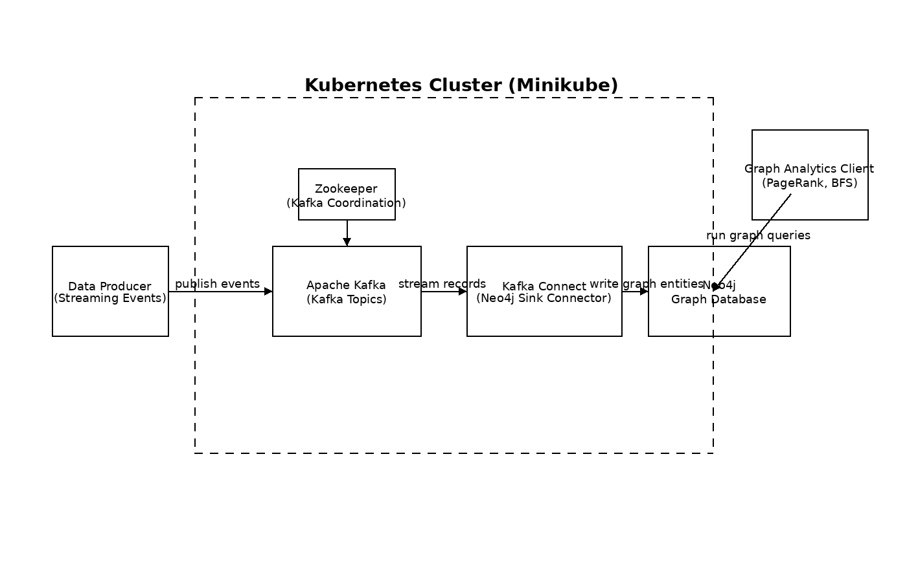

# Streaming Graph Data Processing Pipeline

This repository documents the design and architecture of a distributed, streaming
graph data processing pipeline built using Kubernetes, Apache Kafka, and Neo4j.

The system ingests real-time transportation events, models them as a graph, and
supports graph analytics such as PageRank and Breadth-First Search (BFS).

> **Note**  
> This repository contains architecture diagrams, system design explanations,
> and results summaries only. Implementation code is kept private to comply with
> academic integrity policies.

---

## System Overview

The pipeline is composed of the following components:

- **Apache Kafka** for real-time data ingestion
- **Kafka Connect** for streaming data into Neo4j
- **Neo4j Graph Database** for graph storage and analytics
- **Kubernetes (Minikube)** for container orchestration

The project was implemented in two phases:
1. A Dockerized Neo4j graph ingestion and analytics setup
2. A Kubernetes-based streaming pipeline using Kafka and Neo4j

---

## High-Level Architecture

At a high level, the data flows as follows:

1. Streaming events are produced into Kafka topics
2. Kafka Connect consumes events and transforms them into graph entities
3. Neo4j stores locations as nodes and trips as relationships
4. Graph algorithms are executed using Neo4j Graph Data Science (GDS)

---

## Graph Data Model

### Nodes
- **Location**
  - `name` (Location ID)

### Relationships
- **TRIP**
  - `distance`
  - `fare`
  - `pickup_dt`
  - `dropoff_dt`

This model enables efficient traversal and ranking across connected locations.

---

## Graph Analytics

### PageRank
Used to identify high-importance locations based on inbound connectivity and
weighted trip relationships.

### Breadth-First Search (BFS)
Used to compute traversal paths between locations in the transportation graph.

Both algorithms were executed using Neo4j Graph Data Science.

---

## Validation & Results

- End-to-end ingestion from Kafka to Neo4j was validated
- Graph schema and relationship counts were verified
- PageRank and BFS outputs were validated against expected traversal behavior

Screenshots and summaries are available in the `results/` directory.

---

## Tech Stack

- Kubernetes (Minikube)
- Apache Kafka & Kafka Connect
- Neo4j + Graph Data Science
- Docker
- Python (Neo4j driver, Pandas)

---

## Academic Integrity

This project was completed as part of graduate-level coursework.
All implementation code, configuration files, and datasets are kept private
to comply with academic integrity and plagiarism policies.
